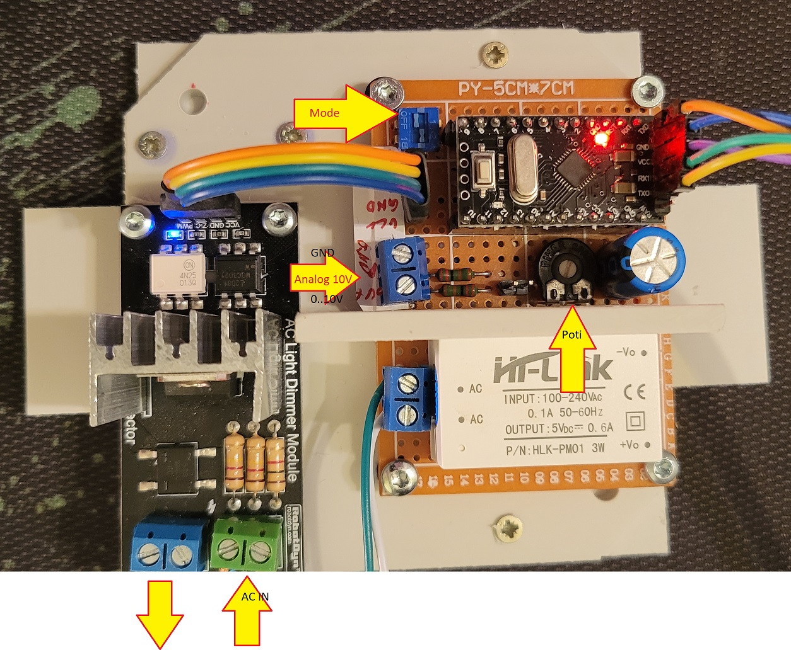

# kitchen-fan-controller

Kitchen fan controller based on ATMEGA328P with 0..10V input

## Mode Switches

| Switch 1 | Switch 2 | Mode |
|----------|----------|------|
| 0 | 0 | FIXED_MODE_90 |
| 0 | 1 | On-Board Potentiometer Mode 0..100%|
| 1 | 0 | External Analog Input Mode 0..10V 10..90% |
| 1 | 1 | External Analog Input Mode 0..10V 0..100% |

## Prototyp

  